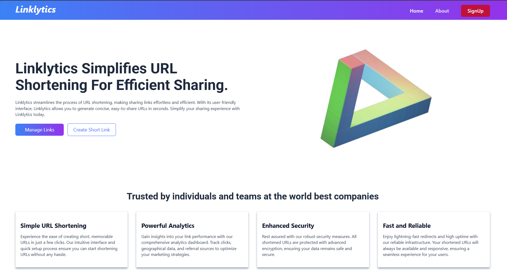

# Linklytics: URL Management App(SpringBoot App) 

## 📸 Screenshots

### Homepage

### Course Page

### Features

# 📚 Linklytics - Shorten Your URL's with Ease

Linklytics is a link management platform that allows users to shorten, customize, and track URLs. Originally known for its core feature of shortening long web addresses to make them easier to share, especially on social media and messaging platforms, Linklytics has evolved into a comprehensive tool for digital marketers and businesses.

---

## 🚀 Features

- 🔐 User Authentication (Login/Signup)
- 👥 Role-based Dashboard
- 📊 Progress Tracking 
- 🛠 Admin Panel for Management
- 💻 Responsive UI using TailwindCSS

---

## 🛠️ Tech Stack

### Frontend:
- React.js
- TailwindCSS
- React Router DOM

### Backend:
- Spring Boot
- MySQL
- JWT Authentication
- 
---

## Project Description

🔗 Linklytics
Linklytics is a full-stack URL management web application that enables users to shorten links, manage redirection, and gain insight through detailed analytics. Whether you're a marketer, developer, or just someone who shares links frequently, Linklytics offers a powerful yet simple solution for handling URLs effectively.

🚀 Features
🔁 URL Shortening & Redirecting
Easily generate short links that redirect to long URLs. Custom aliases are supported for better branding and memorability.

📊 URL Analytics
Gain valuable insights such as:

Total click counts

Timestamp of visits

Referrer websites

Geolocation and device info (optional/coming soon)

🧭 Link Management Dashboard
Manage your links in one place with a clean and intuitive interface. Edit, delete, or search through your links with ease.

🛡️ Authentication & Security
Users can register and log in securely. Routes are protected using Spring Security to ensure data privacy.

🎯 Scalable Architecture
Designed with modularity and scalability in mind — suitable for individual use or deployment at scale.

⚙️ Tech Stack
🧩 Frontend
React.js – Component-based UI for a dynamic single-page application (SPA)

Tailwind CSS – Utility-first CSS framework for rapid UI development

🔧 Backend
Spring Boot – Lightweight Java framework for building robust REST APIs

Spring Data JPA – For seamless interaction with the database

Spring Security – Handles authentication and route protection

🗃️ Database
MySQL – Relational database for storing URL mappings and user data

## System Architecture

The Linklytics platform consists of three main components: the front end, the
back end, and the database. The platform follows a client-server architecture, with the
front end serving as the client and the back end and database serving as the server.

### Front-end 

The front end of the platform is built using ReactJS, ReactJS allows for the creation of dynamic and responsive user
interfaces, which are critical for providing an engaging learning experience to the users.
The front end communicates with the back end using RESTful API calls

### Back-end 

The back end of the platform is built using Spring Boot,. The back end
provides APIs for the front end to consume, which include functionalities such as user
authentication, url creation, and URLs management. The back end also handles the
logic for processing and storing the URLs and user data.

### Database

The database for the platform is built using MySQL, which is a SQL database that
provides a flexible and scalable data storage solution. MySQL allows for the storage of
structured data. The database stores the Origitnal URLs, Shorten URLs, user data, and other
relevant information related to the platform.

## API Design

The StudyNotion platform's API is designed following the REST architectural style. The
API is implemented using Node.js and Express.js. It uses JSON for data exchange and
follows standard HTTP request methods such as GET, POST, PUT, and DELETE.
Sample list of API endpoints and their functionalities: 
1. /api/auth/signup (POST) - Create a new user account.
2. /api/auth/login (POST) – Log in using existing credentials and generate a JWT
token.
3. /api/urls/shorten (POST) - Create a Short URL
4. /api/urls/myurls (GET) - Get user urls.
5./api/urls/analytics/{shortUrl} (GET) - Get URL Analytics.
6. /api/urls/totalClicks (GET) - Get Total Clicks for the url
7. /{shortUrl} (GET) - Redirect to the Original URL

In conclusion, the REST API design for the Linklytics platform is a crucial part
of the project. The API endpoints and their functionalities are designed to ensure seamless
communication between the front-end and back-end of the application. By following
RESTful principles, the API will be scalable, maintainable, and reliable. The sample API
requests and responses provided above illustrate how each endpoint will function and
what kind of data it will accept or return. With this API design, Linklytics will be able to
provide a smooth user experience while ensuring security and stability.
